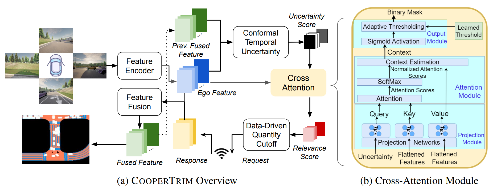
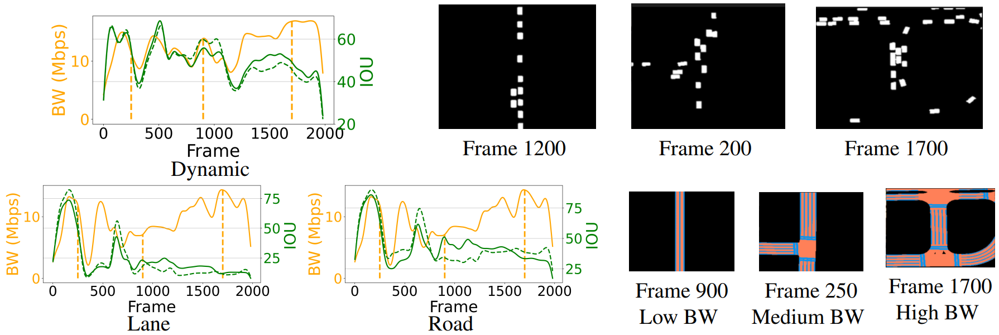

# COOPERTRIM: Adaptive Data Selection For Uncertainty-Aware Cooperative Perception 

Official Pytorch Implementation of the framework **COOPERTRIM** proposed in our paper [**COOPERTRIM: Adaptive Data Selection For Uncertainty-Aware Cooperative Perception**]([https://openreview.net/pdf?id=8NgKNuHRiH]) accepted by **ICLR2026**.

[](https://openreview.net/pdf?id=8NgKNuHRiH)
[](https://opensource.org/licenses/MIT) 
[](https://shilpa2301.github.io/CooperTrim_Website/)


<div align="center">
  
  <div>&nbsp;</div>

  <div>&nbsp;</div>
</div>

## Overview
We present <strong>COOPERTRIM</strong>, an adaptive feature selection framework in cooperative perception, which enhances representation learning through temporal uncertainty-driven feature selection for bandwidth-efficient, accurate perception in multi-agent systems. It addresses key challenges of relevance, identifying the most impactful features for downstream tasks, and quantity, determining the optimal point to stop sharing based on scene and task complexity. We employed an ϵ-greedy training method that optimizes the bandwidth performance balance by facilitating effective exploration and exploitation during training. 

<p align="center">

</p>

<p align="center">

</p>

## News:
- 12/20/2025: First version of CooperTrim released.
## Features
- Provide easy data API for multiple popular multi-agent perception dataset:
  - [x] [OPV2V [ICRA2022]](https://mobility-lab.seas.ucla.edu/opv2v/)
  - [x] [V2V4Real [CVPR2023 Highlight]](https://arxiv.org/abs/2303.07601)
- Provide APIs to allow users use different sensor modalities
  - [x] LiDAR APIs
  - [x] Camera APIs
  - [ ] Radar APIs
- Provide multiple SOTA 3D detection backbone:
    - [X] [PointPillar](https://arxiv.org/abs/1812.05784)
    - [X] [Pixor](https://arxiv.org/abs/1902.06326)
    - [X] [VoxelNet](https://arxiv.org/abs/1711.06396)
    - [X] [SECOND](https://www.mdpi.com/1424-8220/18/10/3337)
- Support multiple sparse convolution versions
  - [X] Spconv 1.2.1
  - [X] Spconv 2.x
- Support  SOTA multi-agent perception models:
    - [x] [Attentive Fusion [ICRA2022]](https://arxiv.org/abs/2109.07644)
    - [x] [Cooper [ICDCS]](https://arxiv.org/abs/1905.05265)
    - [x] [F-Cooper [SEC2019]](https://arxiv.org/abs/1909.06459)
    - [x] [V2VNet [ECCV2022]](https://arxiv.org/abs/2008.07519)
    - [ ] [CoAlign (fusion only) [ICRA2023]](https://arxiv.org/abs/2211.07214)
    - [ ] [FPV-RCNN [RAL2022]](https://arxiv.org/pdf/2109.11615.pdf)
    - [x] [DiscoNet [NeurIPS2021]](https://arxiv.org/abs/2111.00643)
    - [ ] [V2X-ViT [ECCV2022]](https://github.com/DerrickXuNu/v2x-vit)
    - [x] [CoBEVT [CoRL2022]](https://arxiv.org/abs/2207.02202)  
    - [ ] [AdaFusion [WACV2023]](https://arxiv.org/abs/2208.00116)  
    - [x] [Where2comm [NeurIPS2022]](https://arxiv.org/abs/2209.12836)
    - [ ] [V2VAM [TIV2023]](https://arxiv.org/abs/2212.08273)
    - [x] [SwissCheese [TIV2024]](https://ieeexplore.ieee.org/document/10732008) 

- **Provide a convenient log replay toolbox for OPV2V dataset.** Check [here](logreplay/README.md) to see more details.

## OPV2V Data Downloading
All the data can be downloaded from [UCLA BOX](https://ucla.app.box.com/v/UCLA-MobilityLab-OPV2V). If you have a good internet, you can directly
download the complete large zip file such as `train.zip`. In case you suffer from downloading large files, we also split each data set into small chunks, which can be found 
in the directory ending with `_chunks`, such as `train_chunks`. After downloading, please run the following command to each set to merge those chunks together:
```python
cat train.zip.part* > train.zip
unzip train.zip
```

### Installation
Please refer to [data introduction](https://opencood.readthedocs.io/en/latest/md_files/data_intro.html)
and [installation](https://opencood.readthedocs.io/en/latest/md_files/installation.html) guide to prepare
data and install CooperTrim. To see more details of OPV2V data, please check [our website.](https://mobility-lab.seas.ucla.edu/opv2v/)

## V2V4Real Data Downloading
Please check V2V4Real's [website](https://research.seas.ucla.edu/mobility-lab/v2v4real/) to download the data (OPV2V format).

After downloading the data, please put the data in the following structure:
```shell
├── v2v4real
│   ├── train
|      |── testoutput_CAV_data_2022-03-15-09-54-40_1
│   ├── validate
│   ├── test
```

## Quick Start

This section provides instructions to quickly set up, visualize, train, and test the **CooperTrim** framework for Cooperative Perception in autonomous driving. Follow the steps below to get started.

### Installation

Before proceeding with visualization, training, or testing, ensure you have the necessary environment and dependencies set up:

```bash
# Clone repo
git clone https://github.com/shilpa2301/CooperTrim.git

cd CooperTrim
```
Go to any folder of interest : Segmentation_OPV2V / 3D_Detection_OPV2V / 3D_Detection_V2V4Real. 
#### For Segmentation_OPV2V:
```
# Setup conda environment
conda env create -f cobevt_env.yaml
```
#### For 3D_Detection_OPV2V:
```
# Setup conda environment
conda env create -f opencood_env.yaml
```
#### For 3D_Detection_V2V4Real:
```
# Setup conda environment
conda env create -f opencood_env.yaml
```

```
conda activate {particular}_env
conda install pytorch==1.11.0 torchvision==0.12.0 cudatoolkit=11.3 -c pytorch

# Install dependencies
python setup.py build_ext --inplace
python setup.py develop

pip install shapely --only-binary shapely
```

### Visualization

To quickly visualize a single sample of the data with CooperTrim:

```bash
cd CooperTrim
python coopertrim/visualization/visualize_data.py [--scene ${SCENE_NUMBER} --sample ${SAMPLE_NUMBER}]
```

- **scene**: The ith scene in the data. Default: 4
- **sample**: The jth sample in the ith scene. Default: 10

### Training
Before training, the correct config file needs to be placed in the --model_dir folder (eg. checkpoints_test). The configs are available in configs_folder. Select the config as per training need, copy and paste it to the folder referenced by --model_dir. Rename the file to "config.yaml". 

#### Training on 1 GPU

To train CooperTrim using a single GPU------
For Segmentation Task:
```bash
python coopertrim/tools/train_perception.py --hypes_yaml ${CONFIG_FILE} [--model_dir ${CHECKPOINT_FOLDER}]
```

Example:

```bash
python coopertrim/tools/train_perception.py --hypes_yaml coopertrim/checkpoints_test/config.yaml --model_dir coopertrim/checkpoints_test
```
For Detection tasks:
```
python opencood/tools/train.py --hypes_yaml opencood/ckp_test/config.yaml --model_dir  opencood/ckp_test [--half]
```

#### Training on Multiple GPUs

To train CooperTrim using multiple GPUs with distributed training:

```bash
CUDA_VISIBLE_DEVICES=0,1,2,3 python -m torch.distributed.launch --nproc_per_node=4 --use_env coopertrim/tools/train_perception.py --hypes_yaml coopertrim/checkpoints_orig/config.yaml --model_dir coopertrim/checkpoints_orig
```

### Testing

#### Testing on 1 GPU

To test CooperTrim using a single GPU----------
For Segmentation Task:
```bash
python coopertrim/tools/inference_perception.py --model_dir coopertrim/checkpoints_test [--model_type static]
```
The evaluation results  will be dumped in the model directory. 

For Detection Tasks:
```
python opencood/tools/inference.py --model_dir opencood/checkpoints_test --fusion_method intermediate
```

### Pretrained models: [Model Link](https://huggingface.co/shilpa2301/CooperTrim)

## Tutorials
We have a series of tutorials to help you understand OpenCOOD more. Please check the series of our [tutorials](https://opencood.readthedocs.io/en/latest/md_files/config_tutorial.html).


## Citation
 If you are using our CooperTrim framework for your research, please cite the following paper:
 ```bibtex
@inproceedings{mukh2026coopertrim,
  title={COOPERTRIM: Adaptive Data Selection for Uncertainty-Aware Cooperative Perception},
  author={Shilpa Mukhopadhyay, Amit Roy-Chowdhury, Hang Qiu},
  booktitle={International Conference on Learning Representations},
  year={2026},
  url={https://openreview.net/forum?id=8NgKNuHRiH}
}
```

