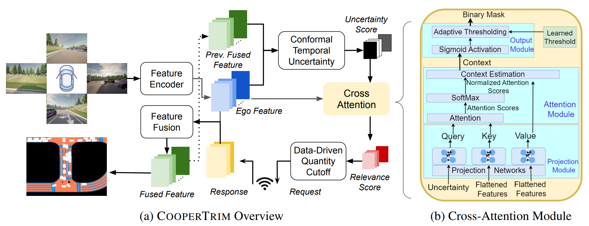
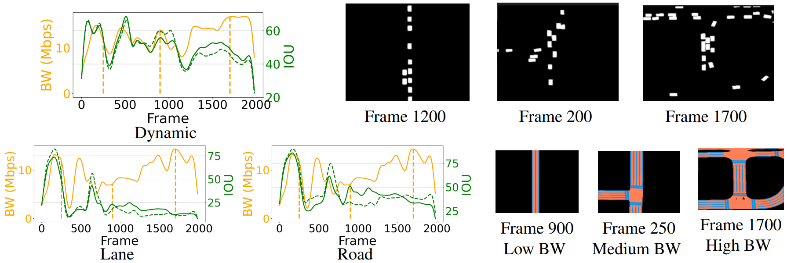
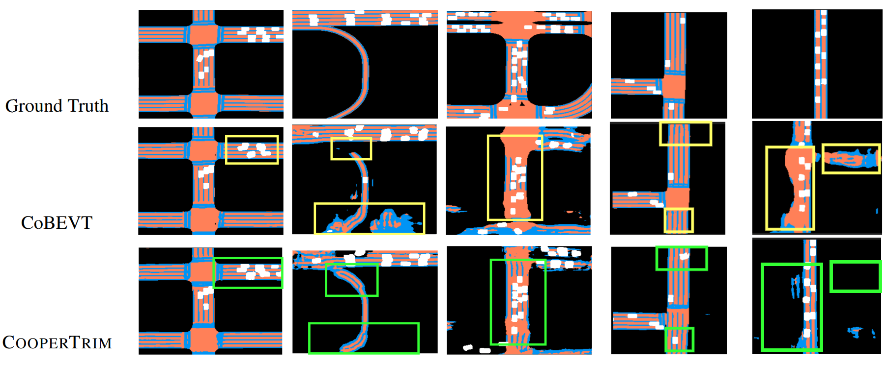

# COOPERTRIM: Adaptive Data Selection For Uncertainty-Aware Cooperative Perception 

Official Pytorch Implementation of [**COOPERTRIM: Adaptive Data Selection For Uncertainty-Aware Cooperative Perception**](https://openreview.net/pdf?id=8NgKNuHRiH), **ICLR2026**.

[](https://openreview.net/pdf?id=8NgKNuHRiH)
[](https://opensource.org/licenses/MIT) 
[](https://cisl.ucr.edu/CooperTrim)
[](https://huggingface.co/cisl-hf/CooperTrim)

<div align="center">
  
</div>

## Overview

We present <strong>COOPERTRIM</strong>, an adaptive feature selection framework in cooperative perception, which enhances representation learning through temporal uncertainty-driven feature selection for bandwidth-efficient, accurate perception in multi-agent systems. It addresses key challenges of relevance, identifying the most impactful features for downstream tasks, and quantity, determining the optimal point to stop sharing based on scene and task complexity. We employed an ϵ-greedy training method that optimizes the bandwidth-performance balance by facilitating effective exploration and exploitation during training.

CooperTrim is compatible with multiple intermediate fusion models — CoBEVT, AttFuse, DiscoNet, F-Cooper, SwissCheese, and Where2comm — without modifying their underlying architectures.

<p align="center">

</p>

<p align="center">

</p>

COOPERTRIM adaptively requests data based on scene complexity. Dynamic objects trigger higher request volumes (Frames 1200, 200, 1700), as do complex static elements like intersections (Frames 900, 250, 1600). Solid green lines indicate CooperTrim maintains high IoU despite reduced bandwidth compared to baseline CoBEVT (dashed green lines).


## Getting Started

### Data Preparation

**OPV2V:** Download from [UCLA BOX](https://ucla.app.box.com/v/UCLA-MobilityLab-OPV2V). For large files, use the chunked downloads and merge:
```bash
mkdir -p train && unzip 'train_*.zip' -d train
```
Organize the downloaded splits so the final layout is:
```
OPV2V/
├── train/      # training scenes (each scene folder directly inside)
├── validate/   # validation scenes
└── test/       # test scenes
```

> **Segmentation only:** The segmentation pipeline requires BEV semantic label files (`bev_dynamic.png`, `bev_static.png`, `bev_lane.png`, etc.) that are **not** included in the standard OPV2V download. Download the additional label archive (`additional.zip`) from the same UCLA BOX folder, unzip it, and merge each split into the corresponding directory:
> ```bash
> rsync -a additional/train/    OPV2V/train/
> rsync -a additional/validate/ OPV2V/validate/
> rsync -a additional/test/     OPV2V/test/
> ```

See [our website](https://mobility-lab.seas.ucla.edu/opv2v/) for dataset details.

**V2V4Real:** Download from the [V2V4Real website](https://research.seas.ucla.edu/mobility-lab/v2v4real/) (OPV2V format). Organize as:
```
v2v4real/
├── train/
│   └── testoutput_CAV_data_2022-03-15-09-54-40_1/
├── validate/
└── test/
```

### Installation

```bash
git clone https://github.com/UCR-CISL/CooperTrim.git
cd CooperTrim
```

Go to the sub-folder for your task: `Segmentation_OPV2V`, `3D_Detection_OPV2V`, or `3D_Detection_V2V4Real`.

```bash
# Segmentation_OPV2V:
conda env create -f cobevt_env.yaml
conda activate cobevt_env

# 3D_Detection_OPV2V or 3D_Detection_V2V4Real:
conda env create -f opencood_env.yml
conda activate opencood_env
```

Then compile and install:
```bash
python setup.py build_ext --inplace
python setup.py develop
```

> **Detection only:** Also build the bounding-box overlap extension:
> ```bash
> python opencood/utils/setup.py build_ext --inplace
> ```

### Visualization

```bash
cd CooperTrim
python Segmentation_OPV2V/opv2v/opencood/visualization/visualize_data.py [--scene ${SCENE_NUMBER} --sample ${SAMPLE_NUMBER}]
```

- `--scene`: scene index (default: 4)
- `--sample`: sample index within scene (default: 10)

### Training

**Step 1 — Create a checkpoint directory and copy a config:**

```bash
# Detection (OPV2V)
cd CooperTrim/3D_Detection_OPV2V
mkdir -p opencood/ckpt
cp ../../configs/3D_Detection_OPV2V/config_det_coopertrim_on_cobevt.yaml opencood/ckpt/config.yaml

# Detection (V2V4Real)
cd CooperTrim/3D_Detection_V2V4Real
mkdir -p opencood/ckpt
cp ../../configs/3D_Detection_V2V4Real/config_det_coopertrim_on_cobevt.yaml opencood/ckpt/config.yaml

# Segmentation (OPV2V)
cd CooperTrim/Segmentation_OPV2V/opv2v
mkdir -p opencood/ckpt
cp ../../configs/Segmentation_OPV2V/config_coopertrim_on_cobevt_dyn.yaml opencood/ckpt/config.yaml
```

**Step 2 — Update dataset paths in `opencood/ckpt/config.yaml`:**

Open the file and set these two fields to your local dataset:
```yaml
root_dir: /your/path/to/dataset/train        # training split
validate_dir: /your/path/to/dataset/validate  # validation split
```

**Step 3 — Run training:**

Single GPU:
```bash
# Segmentation
cd CooperTrim/Segmentation_OPV2V/opv2v/
python opencood/tools/train_camera.py --hypes_yaml opencood/ckpt/config.yaml --model_dir opencood/ckpt

# Detection (OPV2V or V2V4Real — same command, run from the respective subfolder)
cd CooperTrim/3D_Detection_OPV2V          # or 3D_Detection_V2V4Real
python opencood/tools/train.py --hypes_yaml opencood/ckpt/config.yaml --model_dir opencood/ckpt [--half]
```

Multiple GPUs:
```bash
# Segmentation
CUDA_VISIBLE_DEVICES=0,1,2,3 torchrun --nproc_per_node=4 opencood/tools/train_camera.py --hypes_yaml opencood/ckpt/config.yaml --model_dir opencood/ckpt

# Detection (OPV2V or V2V4Real)
CUDA_VISIBLE_DEVICES=0,1,2,3 torchrun --nproc_per_node=4 opencood/tools/train.py --hypes_yaml opencood/ckpt/config.yaml --model_dir opencood/ckpt
```

### Testing

Checkpoints saved during training (or downloaded from HuggingFace — see below) are loaded from `--model_dir`. Pass the same directory you used for training, or create a new one for a pretrained checkpoint.

```bash
# Segmentation
cd CooperTrim/Segmentation_OPV2V/opv2v/
python opencood/tools/inference_camera.py --model_dir opencood/ckpt [--model_type static]

# Detection (OPV2V or V2V4Real — same command, run from the respective subfolder)
cd CooperTrim/3D_Detection_OPV2V          # or 3D_Detection_V2V4Real
python opencood/tools/inference.py --model_dir opencood/ckpt --fusion_method intermediate
```

> **V2V4Real note:** Set `validate_dir` in `config.yaml` to the **test** split path before running inference, e.g. `/your/path/to/V2V4Real/test`.

Evaluation results are saved as `eval.yaml` in the model directory.

## Pretrained Checkpoints

All checkpoints are hosted on [HuggingFace](https://huggingface.co/cisl-hf/CooperTrim). Download each `.pth` file, rename it to `net_epoch1.pth`, and place it in the same folder as the corresponding `config.yaml`.

> **Checkpoint naming:** The model loader scans `--model_dir` for files matching `net_epoch*.pth` and picks the highest epoch number. Downloaded HuggingFace checkpoints **must** be renamed to `net_epoch1.pth` (or any `net_epochN.pth`) — files named `latest.pth` or similar will be silently ignored and inference will produce all-zero AP.

`_dyn` = dynamic object target; `_st` = static object target.

### Segmentation (OPV2V, BEV semantic segmentation)

| Checkpoint | Base Model | Target | Link |
|---|---|---|---|
| `baseline_cobevt_dyn.pth` | CoBEVT | Dynamic | [download](https://huggingface.co/cisl-hf/CooperTrim/resolve/main/baseline_cobevt_dyn.pth) |
| `baseline_cobevt_st.pth` | CoBEVT | Static | [download](https://huggingface.co/cisl-hf/CooperTrim/resolve/main/baseline_cobevt_st.pth) |
| `baseline_attfuse_dyn.pth` | AttFuse | Dynamic | [download](https://huggingface.co/cisl-hf/CooperTrim/resolve/main/baseline_attfuse_dyn.pth) |
| `baseline_attfuse_st.pth` | AttFuse | Static | [download](https://huggingface.co/cisl-hf/CooperTrim/resolve/main/baseline_attfuse_st.pth) |
| `baseline_disconet_dyn.pth` | DiscoNet | Dynamic | [download](https://huggingface.co/cisl-hf/CooperTrim/resolve/main/baseline_disconet_dyn.pth) |
| `baseline_disconet_st.pth` | DiscoNet | Static | [download](https://huggingface.co/cisl-hf/CooperTrim/resolve/main/baseline_disconet_st.pth) |
| `baseline_fcooper_dyn.pth` | F-Cooper | Dynamic | [download](https://huggingface.co/cisl-hf/CooperTrim/resolve/main/baseline_fcooper_dyn.pth) |
| `baseline_fcooper_st.pth` | F-Cooper | Static | [download](https://huggingface.co/cisl-hf/CooperTrim/resolve/main/baseline_fcooper_st.pth) |
| `baseline_swisscheese_dyn.pth` | SwissCheese | Dynamic | [download](https://huggingface.co/cisl-hf/CooperTrim/resolve/main/baseline_swisscheese_dyn.pth) |
| `baseline_swisscheese_st.pth` | SwissCheese | Static | [download](https://huggingface.co/cisl-hf/CooperTrim/resolve/main/baseline_swisscheese_st.pth) |
| `baseline_where2comm_dyn.pth` | Where2comm | Dynamic | [download](https://huggingface.co/cisl-hf/CooperTrim/resolve/main/baseline_where2comm_dyn.pth) |
| `baseline_where2comm_st.pth` | Where2comm | Static | [download](https://huggingface.co/cisl-hf/CooperTrim/resolve/main/baseline_where2comm_st.pth) |
| `coopertrim_cobevt_dyn.pth` | CoBEVT + **CooperTrim** | Dynamic | [download](https://huggingface.co/cisl-hf/CooperTrim/resolve/main/coopertrim_cobevt_dyn.pth) |
| `coopertrim_cobevt_st.pth` | CoBEVT + **CooperTrim** | Static | [download](https://huggingface.co/cisl-hf/CooperTrim/resolve/main/coopertrim_cobevt_st.pth) |
| `coopertrim_attfuse_dyn.pth` | AttFuse + **CooperTrim** | Dynamic | [download](https://huggingface.co/cisl-hf/CooperTrim/resolve/main/coopertrim_attfuse_dyn.pth) |
| `coopertrim_attfuse_st.pth` | AttFuse + **CooperTrim** | Static | [download](https://huggingface.co/cisl-hf/CooperTrim/resolve/main/coopertrim_attfuse_st.pth) |
| `coopertrim_disconet_dyn.pth` | DiscoNet + **CooperTrim** | Dynamic | [download](https://huggingface.co/cisl-hf/CooperTrim/resolve/main/coopertrim_disconet_dyn.pth) |
| `coopertrim_disconet_st.pth` | DiscoNet + **CooperTrim** | Static | [download](https://huggingface.co/cisl-hf/CooperTrim/resolve/main/coopertrim_disconet_st.pth) |

### Detection (3D object detection)

| Checkpoint | Dataset | Method | Link |
|---|---|---|---|
| `det_opv2v_baseline_cobevt.pth` | OPV2V | CoBEVT baseline | [download](https://huggingface.co/cisl-hf/CooperTrim/resolve/main/det_opv2v_baseline_cobevt.pth) |
| `det_opv2v_coopertrim.pth` | OPV2V | **CooperTrim** | [download](https://huggingface.co/cisl-hf/CooperTrim/resolve/main/det_opv2v_coopertrim.pth) |
| `det_v2v4real_baseline_cobevt.pth` | V2V4Real | CoBEVT baseline | [download](https://huggingface.co/cisl-hf/CooperTrim/resolve/main/det_v2v4real_baseline_cobevt.pth) |
| `det_v2v4real_coopertrim.pth` | V2V4Real | **CooperTrim** | [download](https://huggingface.co/cisl-hf/CooperTrim/resolve/main/det_v2v4real_coopertrim.pth) |


## Acknowledgement
We sincerely thank the developers and contributors of the many open-source projects that our code is built upon: [OPV2V](https://github.com/DerrickXuNu/OpenCOOD), [V2V4REAL](https://github.com/ucla-mobility/v2v4real), [CoBEVT](https://github.com/DerrickXuNu/CoBEVT).


## Citation

If you use CooperTrim in your research, please cite:
```bibtex
@inproceedings{mukhopadhyaycoopertrim,
  title={CooperTrim: Adaptive Data Selection for Uncertainty-Aware Cooperative Perception},
  author={Mukhopadhyay, Shilpa and Roy-Chowdhury, Amit and Qiu, Hang},
  booktitle={The Fourteenth International Conference on Learning Representations}
}
```
